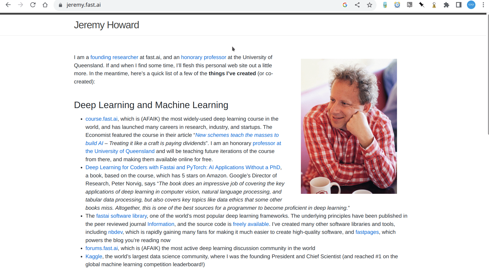

#  Excusez Moi

Semantic search on webpages by asking natural questions

## About

Ctrl+Shift+F is all you need!

Ctrl+F might not always be your Swiss Army knife for quickly finding information in huge webpages. This extension tries to fix that by allowing you to ask questions in natural language. It can also help you find URLs buried in hyperlinks.

### How it works

Whenever you activate the extension (either by clicking on the icon / key shortcut), it first starts to understand  [^1] the article. Once ready, as you can write your query in the box and submit, it'll fetch the answers [^2] and highlight them on the webpage.

In case you're wondering, yes there's a backend component ([source code](https://github.com/rounakdatta/excusez-moi-proxy)) to which this extension sends requests to. It does the OpenAI talking, some coordination and a bit of caching.

[^1]: The article's entire textual content is sent to OpenAI to generate embeddings out of it
[^2]: The search query terms' embeddings are also generated and matched across the document's embeddings for relevant sections. OpenAI's chat completion is able to generate an answer out of the relevant sections.

### Interesting demos

### Get going

#### Chrome Web Store
*Chrome Web Store link would be available as soon as Google senpai approves it*

#### Build from source
- Download as ZIP
- Load as unpackaged extension

## Contribution

The extension is rough around the edges, and often points out inaccurate results. Pull requests are welcome!

## Logo

A haystack and a magnifying glass.

## Credits

- This project was bootstrapped with [Chrome Extension CLI](https://github.com/dutiyesh/chrome-extension-cli)
- This project was heavily inspired by the architecture and UI elements of [Shift-Ctrl-F](https://github.com/model-zoo/shift-ctrl-f)
